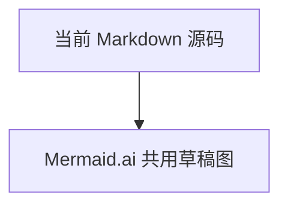

# Markdown 一键打开 Mermaid.ai

[](https://github.com/Async23/mermaid-ai-links/actions/workflows/ci.yml)
[](https://www.python.org/)
[](LICENSE)

这是一个实验性的 macOS 本机工具项目。它不依赖 Hive 或任何特定知识库，可处理任意绝对路径下的 Markdown 文件。整体架构见 [`docs/C4.md`](docs/C4.md)。

> [!IMPORTANT]
> 本项目是非官方浏览器自动化工具，与 Mermaid Chart / Mermaid.ai 无隶属或背书关系。使用前请阅读 [Mermaid Chart Terms of Use](https://mermaid.ai/terms-of-use/)，并自行确认自动化方式及待发送内容符合你的账号、组织政策和服务条款。

这套本机工具给 Markdown 中的每个 Mermaid 代码块生成且只生成一条标准 HTTP 链接：

````md
[↗ 在 Mermaid.ai 打开](http://127.0.0.1:38473/v1/open/...)

````

同一个安装包提供三个入口，但只维护一套核心逻辑：

```text
CLI  -> 人、脚本和 Agent Skill
HTTP -> Typora、VS Code、Obsidian 中的普通链接
MCP  -> Codex、Claude、Cursor 等 AI Host
             |
             v
共享 Application Interface -> 唯一 HTTP Bridge -> Chrome / Mermaid.ai
```

Typora、VS Code Markdown Preview、Obsidian 都只需打开这条普通 `http://127.0.0.1` 链接，不需要各自的插件。点击链路是：

```text
Markdown link
  -> 本机服务校验签名并定位 document + block_id
  -> 返回已完整加载的本机等待页并预检 Chrome/CDP
  -> 等待页把同一个标签导航到带一次性 job fragment 的固定 edit URL
  -> 服务通过 Chrome CDP 只锁定这个标签并读取当前 Mermaid 源码
  -> 页内显示“正在载入”遮罩，Playwright 写入固定 __inject_scratch__ 并验证预览
  -> 瞬时故障在同一标签自动重试一次；最终失败则把该标签替换成本机错误页
  -> 移除一次性 fragment，地址栏恢复精确 mermaid.ai edit URL
```

链接不保存 Mermaid 源码快照。只修改代码块内容时链接保持不变，点击仍会读取最新内容；增加、删除、复制或移动整个代码块后再运行一次 `mermaid-ai-links sync` 即可补齐或整理链接。

签名链接中的 token 会编码 Markdown 的绝对路径，但不会加密它。请勿把本机生成的链接提交到公开仓库。本仓库的 [`docs/C4.md`](docs/C4.md) 因此只保留可公开的 Mermaid 源码；本机点击版应使用被 Git 忽略的 `docs/*.local.md` 副本。

## 当前运行边界

- 所有 Mermaid 块共用一张 `__inject_scratch__`，后一次点击覆盖前一次。
- 每个 Mermaid 块只有一条 Mermaid.ai App 链接；生成器会替换相邻的旧 App 链接并删除旧 Mermaid Live 生成链接。
- 服务只绑定 `127.0.0.1`，请求必须带本机密钥签名，且签名覆盖绝对文件路径与稳定 `block_id`。
- MCP 的打开操作通过派生认证令牌调用同一个 HTTP Bridge；真实签名密钥不会通过 MCP 或控制请求传输。
- MCP stdio 与 CLI 一样继承启动用户的文件权限，只处理调用时明确给出的 `.md` / `.markdown` 路径；只应配置给受信任的本机 AI Host。
- `HEAD` 请求绝不触发注入，避免 Markdown 预览器的链接探测产生副作用。
- 当前只支持手动 `start/status/stop`，**不会创建、加载或修改 macOS LaunchAgent**。
- HTTP 点击只更新带本次 marker 的标签；CLI/MCP 会复用或创建后台草稿标签。两条链路都只用 CDP focus emulation 驱动 Monaco，不会把 Chrome 或标签切到前台。
- 注入期间会遮住共用草稿的旧内容；成功才显示新图。瞬时故障自动重试一次，最终失败会显示错误与“重新尝试”，不会让旧图冒充本次结果。
- 每次失败及重试都会写入持久日志，包含 `job_id`、尝试次数和具体错误。
- 系统外链必须交给 `cdp_url` 所指向的同一个 Chrome 实例；仓库提供真实 E2E 脚本用于本机验收。

## 1. 固定草稿图与 Chrome

固定图必须是可编辑的 Mermaid.ai Code Editor 页面，URL 格式为：

```text
https://mermaid.ai/app/projects/<PROJECT_ID>/diagrams/<DIAGRAM_ID>/version/<VERSION>/edit
```

建议图名 `__inject_scratch__`。Chrome 启动命令：

```zsh
CHROME='/Applications/Google Chrome.app/Contents/MacOS/Google Chrome'
PROFILE="$HOME/Library/Application Support/Google/Chrome-Mermaid-AI"
"$CHROME" \
  --remote-debugging-port=9222 \
  --user-data-dir="$PROFILE" \
  --no-first-run \
  --no-default-browser-check
```

首次需要在这个 profile 中登录 Mermaid.ai。Typora、VS Code、Obsidian 点击外链时也必须由这个 Chrome 实例接收；否则服务无法锁定“刚点击的标签”。检查 CDP：

```zsh
curl -fsS http://127.0.0.1:9222/json/version
```

## 2. 配置与命令

前置条件：

- macOS
- Python 3.11 或更高版本
- [`uv`](https://docs.astral.sh/uv/)
- Google Chrome，以及一个专门用于 Mermaid Chart 的浏览器 profile
- 可编辑的 Mermaid Chart 草稿图

项目使用 `uv` 管理环境和命令入口，连接系统 Chrome，不下载 Playwright 自带浏览器。普通安装：

```zsh
uv tool install git+https://github.com/Async23/mermaid-ai-links.git@v0.1.1
```

从源码开发：

```zsh
git clone https://github.com/Async23/mermaid-ai-links.git
cd mermaid-ai-links
uv sync --locked --all-groups
uv tool install --force --editable .
```

初始化本机配置：

```zsh
mkdir -p ~/.config/mermaid-ai-inject
CONFIG="$HOME/.config/mermaid-ai-inject/config.yaml"
test -e "$CONFIG" || \
  curl -fsSL \
    https://raw.githubusercontent.com/Async23/mermaid-ai-links/v0.1.1/config.example.yaml \
    -o "$CONFIG"
chmod 600 ~/.config/mermaid-ai-inject/config.yaml
```

源码开发者也可以用 `cp config.example.yaml "$CONFIG"` 代替下载。只需把本地配置中的 `edit_url` 改成真实固定草稿 URL。Cookie、token、链接签名密钥和真实配置均不提交 Git。

链接密钥首次同步时自动生成在：

```text
~/.config/mermaid-ai-inject/link-secret
```

文件权限会强制为 `0600`。删除或更换密钥后，旧链接会签名失败，需要重新运行 `mermaid-ai-links sync`。

要在 Typora、VS Code 或 Obsidian 中点击本仓库的三张 C4 图，请先创建一个本机副本：

```zsh
cp docs/C4.md docs/C4.local.md
mermaid-ai-links sync docs/C4.local.md
```

`docs/C4.local.md` 已被 `.gitignore` 排除，可以安全保存含本机绝对路径的签名链接。

## 3. 给 Markdown 生成链接

```zsh
mermaid-ai-links sync /absolute/path/to/note.md

# 只检查，不修改
mermaid-ai-links sync --check /absolute/path/to/note.md

# 列出 Mermaid 块、行号、block_id 与链接状态
mermaid-ai-links list /absolute/path/to/note.md
```

生成器支持反引号或波浪线 fence、多个 Mermaid 块、中文和 CRLF，并跳过嵌套在其他 fenced code block 中的伪 Mermaid 文本。重复执行是幂等的；若链接与代码块之间误加空行，同步器会收拢空行并保留原 `block_id`，不会再生成第二条链接。

每条链接中的 `block_id` 是稳定标识：

- 只编辑 Mermaid 源码：不用重新同步链接。
- 在前面插入其他 Mermaid 块：原链接仍指向原块。
- 复制、删除、移动链接或整个代码块：运行一次 `mermaid-ai-links sync` 修复。
- 文件改名或移动：运行一次 `mermaid-ai-links sync` 更新签名路径。

## 4. 手动启动本机链接服务

```zsh
mermaid-ai-links start
mermaid-ai-links status
```

`start` 是当前唯一后台启动入口，由用户显式执行；它不会登录启动，也不会注册系统任务。状态与日志位于：

```text
~/.local/state/mermaid-ai-inject/link-server.pid
~/.local/state/mermaid-ai-inject/link-server.log
```

停止：

```zsh
mermaid-ai-links stop
```

也可前台运行，便于直接观察请求：

```zsh
mermaid-ai-links serve
```

健康检查：

```zsh
curl -fsS http://127.0.0.1:38473/healthz
```

一次检查配置、签名密钥、后台服务和 Chrome/CDP：

```zsh
mermaid-ai-links doctor
```

## 5. 在三款编辑器中使用

确保本机服务处于 `RUNNING` 后，用任一软件打开同一个 `.md`：

1. Typora：直接点击 `[↗ 在 Mermaid.ai 打开]`。
2. VS Code：在 Markdown Preview 中点击；源码编辑区可按住编辑器要求的修饰键点击。
3. Obsidian：阅读视图直接点击；编辑视图按 Obsidian 的外链方式点击。

三者都把同一条标准 HTTP URL 交给系统浏览器。链接先完整加载一个很短的本机等待页，再把同一标签导航到带一次性 fragment 的固定 edit URL。服务只注入这个标签，预览通过后用 `history.replaceState` 移除 fragment，最终地址栏就是固定图的精确 URL。这个两阶段顺序避免了待响应本机导航与 Playwright 初始化互相等待，也不依赖 Mermaid.ai 把临时源码先保存到远端。

Mermaid.ai 页面出现后会先覆盖“正在载入这条 Markdown 对应的 Mermaid 图…”遮罩，遮罩消失且地址栏不再含 `#mermaid-ai-inject=...` 才表示完成。若第一次遇到瞬时 CDP/Monaco 故障，服务会在同一页自动重试一次；仍失败时该页会自动跳回本机错误页，显示原因和“重新尝试”入口。

浏览器是否新开标签由编辑器、系统与浏览器偏好决定；工具不主动复用、关闭或激活用户当前标签。

## 6. MCP 入口

`mermaid-ai-links mcp` 通过 stdio 启动 MCP Adapter，提供四个工具：

```text
doctor
list_diagrams
sync_document
open_diagram
```

AI Host 的通用配置形态：

```json
{
  "mcpServers": {
    "mermaid-ai-links": {
      "command": "mermaid-ai-links",
      "args": ["mcp"]
    }
  }
}
```

stdio MCP 进程由 AI Host 启停；它不占用新的监听端口。`open_diagram` 会通过带派生认证令牌的本机控制请求复用已经运行的 HTTP Bridge，因此只有 Bridge 进程管理 Chrome 和串行注入锁。AI Host 关闭后 MCP 进程可以退出，Markdown 链接仍由常驻 Bridge 处理。

也可以从 CLI 走同一 Application Interface：

```zsh
mermaid-ai-links open /absolute/path/to/note.md --block-index 1
mermaid-ai-links open /absolute/path/to/note.md --block-id <BLOCK_ID>
```

MCP Python SDK 当前使用稳定的 `1.x` 版本并限制 `<2`；等 v2 稳定后再单独评估迁移，不自动接收 beta 的破坏性变化。

## 7. 直接注入 CLI 与 Obsidian 可选命令

标准 Markdown 链接不依赖 Obsidian 插件。原有 CLI 仍可用于诊断或脚本调用：

```zsh
inject-mermaid-ai --code $'flowchart TB\n  Hello-->World'

inject-mermaid-ai \
  --file /absolute/path/to/note.md \
  --block 1

inject-mermaid-ai --file /absolute/note.md --line 104

# 只验证提取，不连接 Chrome
inject-mermaid-ai --file note.md --block 3 --dry-run
```

`integrations/obsidian/mermaid-ai-inject` 中的 Desktop-only Obsidian 插件是可选快捷命令，不参与标准 Markdown 链接链路。

## 8. 常见失败

### 浏览器显示无法连接 `127.0.0.1:38473`

```zsh
mermaid-ai-links status
mermaid-ai-links start
mermaid-ai-links doctor
```

### 链接签名无效或不在代码块正上方

```zsh
mermaid-ai-links sync /absolute/path/to/note.md
```

不要手改链接 URL；可以修改显示文字，但建议保留默认标签。

### Chrome/CDP 不可用

```zsh
curl -fsS http://127.0.0.1:9222/json/version
lsof -nP -iTCP:9222 -sTCP:LISTEN
```

默认 `launch_if_needed: false`。服务不会因为一次点击而弹出 Chrome；请手动启动专用 profile。

### Mermaid.ai 未登录、编辑器超时或预览报错

- 在同一专用 Chrome profile 中确认登录与草稿图编辑权限。
- 确认页面是 Code Editor 且 Auto-Update 可用。
- 查看 `~/.local/state/mermaid-ai-inject/link-server.log`。
- 先用 `inject-mermaid-ai --dry-run` 确认提取到的源码。

失败页不会保留共用草稿中的上一张图。日志中的 `inject attempt FAILED` 会记录第几次尝试和原始错误；若两次都失败，还会记录错误页是否成功显示。

## 9. 自动测试与模拟用户点击

```zsh
# 单元、HTTP 集成及真实 stdio MCP 协议测试
uv run -m unittest discover -s tests -p 'test_*.py'

# 静态检查与构建
uv run ruff check src tests
uv run ruff format --check src tests
uv build

# 真实端到端：后台创建浏览器 target 模拟点击，验证自动跳转、最新源码和预览 DOM
mermaid-ai-links start
uv run tests/e2e_links.py

# 只验收“连续失败后离开旧草稿并显示错误页”
uv run tests/e2e_links.py --failure-only
```

E2E 先模拟连续两次注入失败，验证原标签离开 Mermaid.ai 旧草稿并显示带重试入口的本机错误页。随后创建临时笔记并在生成链接后修改 Mermaid 源码，再用 macOS `open -g` 模拟编辑器的后台系统外链，证明点击读取的是新源码而非链接快照，也证明默认外链进入了当前 CDP Chrome。公开文档本身不含本机链接，E2E 会在临时副本中生成链接，再逐一检查全部 Mermaid 图并恢复第 1 张共用草稿。验收还要求一次性 fragment 已移除、地址栏精确等于固定 edit URL；其余测试 target 均以 `background: true` 创建并在验证后关闭。

## 10. 项目治理

- 安全问题：请按 [`SECURITY.md`](SECURITY.md) 使用 GitHub 私密漏洞报告，不要公开披露。
- 参与开发：见 [`CONTRIBUTING.md`](CONTRIBUTING.md)。
- 社区行为：见 [`CODE_OF_CONDUCT.md`](CODE_OF_CONDUCT.md)。
- 许可证：[MIT](LICENSE)。
