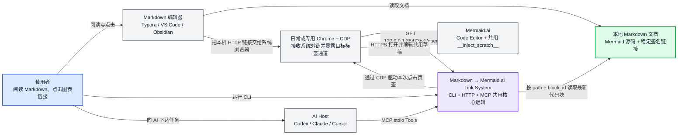
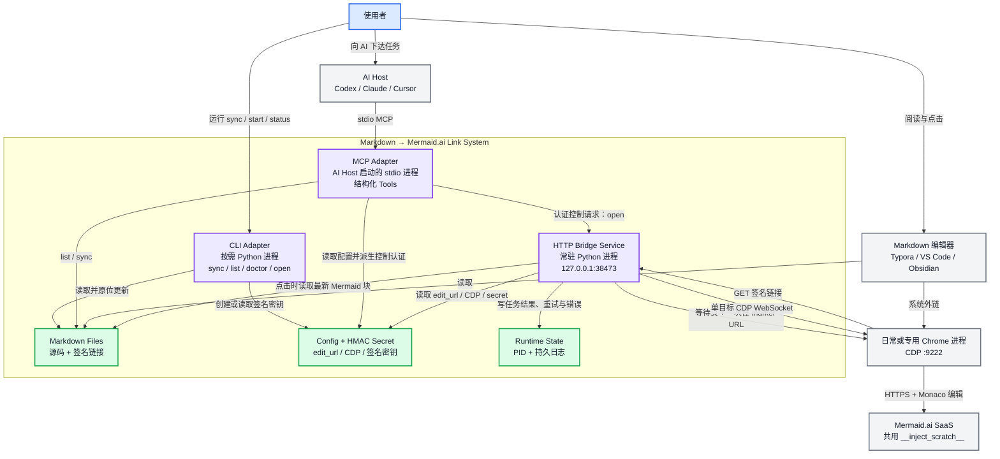
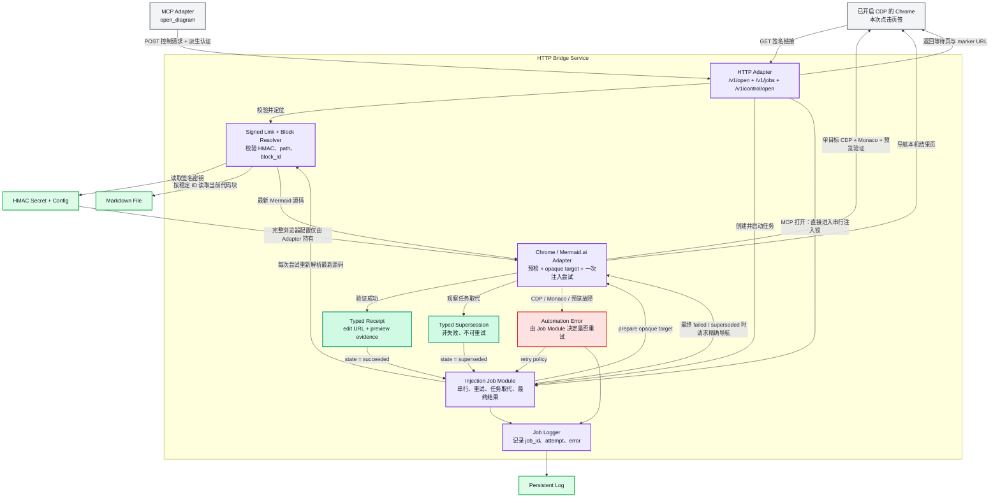

# Markdown → Mermaid.ai 整体流程：C4 L1 / L2 / L3

本文描述同一个安装包中的 CLI、HTTP、MCP 三入口链路：

> 人或 AI 可以通过 CLI/MCP 管理 Mermaid 链接；Typora、VS Code 或 Obsidian 通过普通 HTTP 链接打开图。本机服务读取对应 Mermaid 代码块的最新源码，再通过已开启 9222 的 Chrome/CDP 把源码写入 Mermaid.ai 共用草稿。

## 阅读顺序

| 层级 | 回答的问题 | 本文视角 |
|---|---|---|
| L1 — System Context | 谁在使用系统？系统依赖谁？ | 使用者、AI Host、Markdown 编辑器、本机桥接系统、Chrome、Mermaid.ai |
| L2 — Containers | 系统由哪些可运行单元和存储组成？ | CLI Adapter、MCP Adapter、HTTP Bridge Service、本地文件与状态 |
| L3 — Components | HTTP Bridge Service 如何处理编辑器点击和 MCP 打开？ | 认证、签名解析、串行注入、目标页匹配、验证、重试与失败呈现 |

---

## L1 — System Context

系统边界只看「Markdown → Mermaid.ai Link System」整体，不展开内部 Python 模块。

### L1 关键结论

- Markdown 编辑器只负责打开普通 HTTP 链接，不需要专用插件。
- CLI、HTTP、MCP 是三个 Adapter，背后共用同一个 Application Interface 和浏览器 Bridge。
- MCP 进程由 AI Host 临时启动；常驻 HTTP Bridge 独立存在，因此关闭 AI 不影响 Markdown 链接。
- 本机桥接系统是唯一的自动化边界：它读取源码并控制 Chrome，但不直接调用 Mermaid.ai 私有 API。
- Mermaid.ai 只保留一张共用草稿；「哪条链接对应哪张图」由本机签名链接中的文件路径和稳定 `block_id` 决定。

---

## L2 — Containers

这一层展开可独立运行的进程与持久化文件。注入器不是独立服务，而是运行在 HTTP Bridge Service 进程内。

### L2 容器职责

| 容器 / 存储 | 职责 | 不负责 |
|---|---|---|
| CLI Adapter | 为人和脚本提供 `sync/list/doctor/open/start/stop` | 不实现 Markdown 或浏览器业务逻辑 |
| MCP Adapter | 把相同能力以结构化 Tools 暴露给 AI Host | 不监听新端口、不独占 Chrome |
| HTTP Bridge Service | 校验点击、创建任务、串行注入、重试、呈现最终结果页 | 不保存 Mermaid 源码快照 |
| Markdown Files | 保存权威 Mermaid 源码 | 不保存运行任务状态 |
| Config + HMAC Secret | 保存固定草稿 URL、CDP 地址和本机签名密钥 | 不进入 Markdown 链接明文 |
| Runtime State | 保存 PID 与长期诊断日志 | 不决定链接指向哪个代码块 |

---

## L3 — Components

这一层只放大 `HTTP Bridge Service`。一次点击的成功标准是：预览已出现当前代码块的证据、加载遮罩已移除、地址栏一次性 marker 已清理。

### 一次点击的关键时序

1. 编辑器点击通过签名 `GET /v1/open` 进入；MCP 打开通过派生认证 `POST /v1/control/open` 进入。
2. 两种入口都重新校验签名和当前代码块位置，并共用唯一串行注入锁。
3. Chrome / Mermaid.ai Adapter 完成 CDP 预检查并返回 opaque target；Bridge 只保存 capability 与导航 URL，不理解 marker 格式。
4. Adapter 只连接目标页自身的 CDP WebSocket，不 attach 或初始化同一 Chrome 的其他页面；MCP 打开则在后台查找或创建固定草稿页。
5. Adapter 写入 Monaco 并验证预览；编辑器点击成功时再移除遮罩和 marker，并返回 typed receipt。
6. Bridge 决定是否重试；新任务取代旧任务时，Adapter 返回 typed supersession，旧任务进入独立的 `superseded` 状态而不是伪装成失败。
7. MCP 调用以结构化成功结果或 Tool Error 返回，不让 MCP 进程独占 Chrome。

## 设计不变量

- 每个 Mermaid 代码块恰好一条 App 链接。
- 链接只保存 `path + block_id` 的签名引用，不保存源码快照。
- 点击时读取磁盘上的最新源码。
- 多次点击由单一注入锁串行化，避免共用草稿并发写入。
- 任务取代是独立结果，不通过错误字符串或 `failed` 状态表达。
- Bridge 不读取浏览器配置、一次性 marker 或目标标签 locator；这些知识只存在于 Chrome / Mermaid.ai Adapter。
- CLI 与 MCP 的 `open` 必须通过认证控制入口复用同一个 Bridge。
- 控制认证由 HMAC Secret 派生，不在请求中发送真实 Secret。
- 旧图只能作为底层共用草稿存在；加载遮罩消失前不能被当作本次结果。
- 成功后地址栏必须精确恢复固定 Mermaid.ai edit URL。
- 最终失败必须可见、可重试、可从日志诊断。
